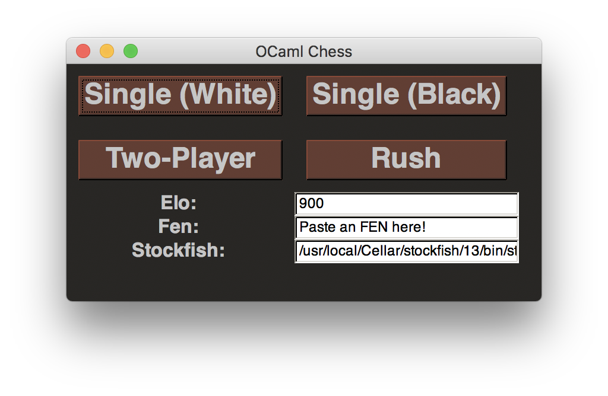
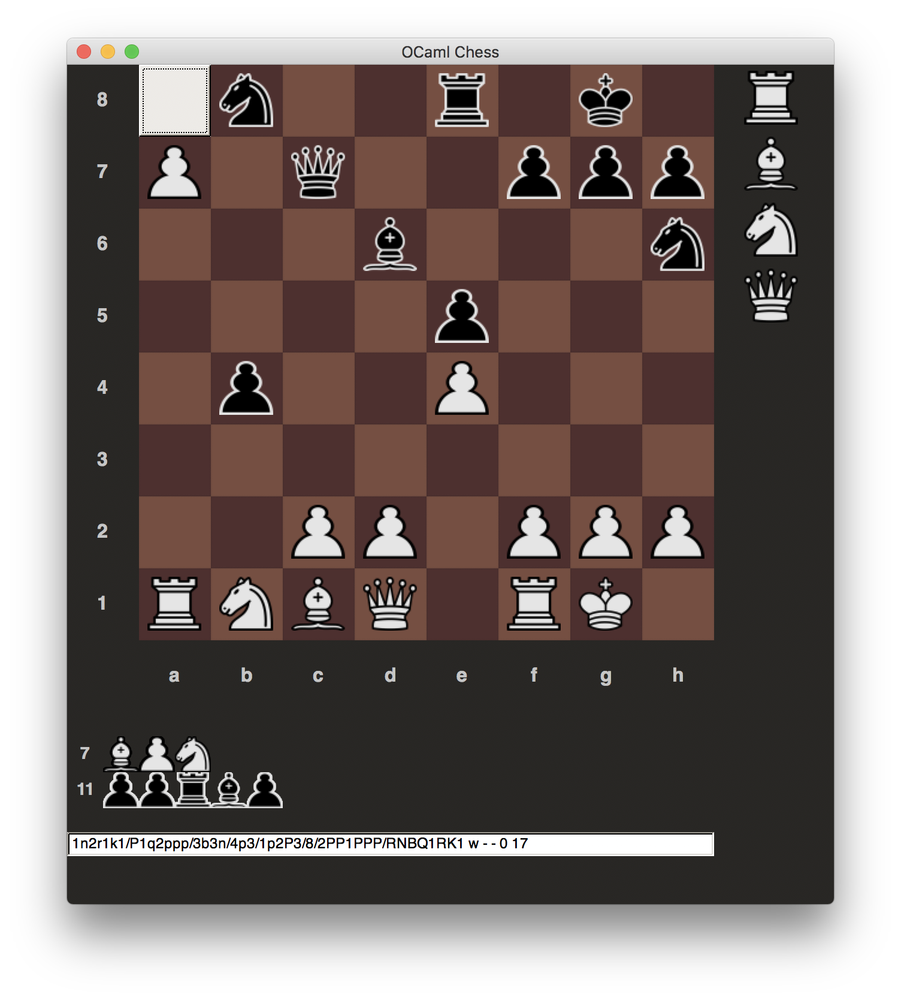
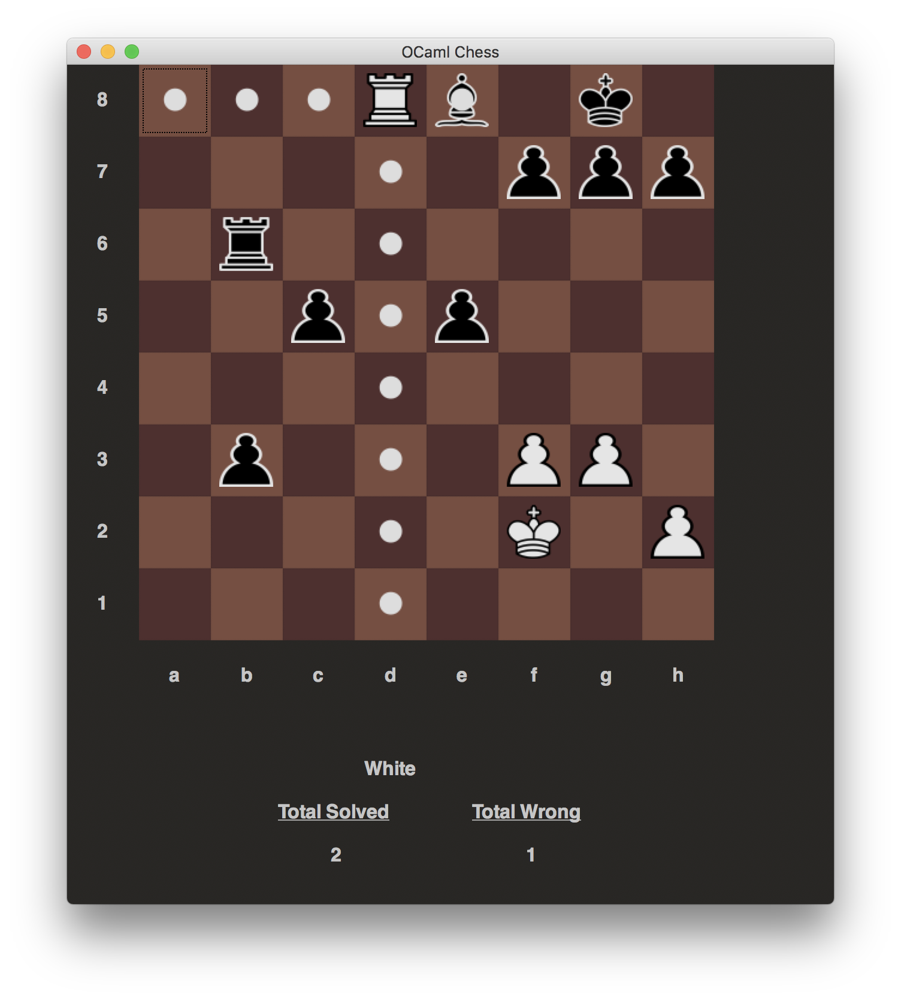

# OCaml Chess

*Created for CS 3110: Functional Programming. Contributors include Anders Wikum
(aew236), Henry Robbins (hwr26), Nalu Concepcion (lac327), and Andy Kim (yk765)*

Welcome to Chess! To start, run `make build` to build the game from the source
code provided in the zip file. Next, run `make test` to verify everything is
working properly.

 <br>



## Installation Intructions

First, clone the repository with

```git clone https://github.coecis.cornell.edu/hwr26/chess.git```

Then, follow the additional installation instructions in
[INSTALL.md](INSTALL)

## Graphical User Interface (GUI)

Run `make gui` to play chess via a graphical user interface! The start menu
offers four ways to play: single player (either as white or black),
two-player, or a puzzle game called rush. If you are playing single player,
you can specify an [elo](https://en.wikipedia.org/wiki/Elo_rating_system)
rating of the opposing player. In either single player or two-player, you can
provide an initial
[FEN](https://en.wikipedia.org/wiki/Forsyth%E2%80%93Edwards_Notation).

### Single Player and Two-Player

When it is your turn, you can select a piece to see the possible valid moves.
These moves are indicated with a small white circle. To make a move, click on
one of squares which is indicated to be a valid move. Afterwards, move the
mouse slighly to initiate the opponent's move (in the case of single player
or rush). In the case of two-player, the board will rotate and the second
player can make their move. When the game reaches a checkmate, stalemate, or
draw, a popup will appear and the game window will lock. You can close the
window and lauch a new game from the start menu.

### Rush

In this puzzle game, you will be fed a series of chess scenarios of increasing
difficulty. It is much the same as the Puzzle Rush game found on
[chess.com](chess.com). Puzzles can be of various lengths. If you make a wrong
move at any point, a popup appears and you are advanced to the next puzzle. If
you get three wrong, the game is over! If you finish all the puzzles with
fewer than three mistakes, you win!

## Command-line Interface

Run `make command-line` to play chess in the command line! To move
a piece, type a command of the form `move [piece_id] [sqaure] to [sqaure]`
where `piece_id` is in `[P,R,B,N,K,Q]` and `square` is a two-character string
of the form `[file][rank]`. For example, `move P d2 to d4` is the command to
move the pawn at sqaure d2 to d4. To quit the game, type `quit`.

## Testing and Documentation

Run `make tests` to run the automatic test suite. Be sure to set `path` at the
top of `test.ml` to a valid path to a stockfish executable. Run `make bisect`
to generate a code coverage report found at `_coverage/index.html`. Run
`make docs` to generate both public and private documentation which can be
found at `_doc.public/index.html` and `_doc.private/index.html` respectively.

## Development

If you are interested in developing OCaml Chess, here are some helpful links.
First, check out the
[Introduction to Gtk](https://ocaml.org/learn/tutorials/introduction_to_gtk.html)
from OCaml. Next, there are two sources of relevant documentation: the
[LablGTK API](https://garrigue.github.io/lablgtk/refdoc/index.html) and the
[GTK+ 3 Reference Manual](https://developer.gnome.org/gtk3/).

Game Assets by [John Pablok](https://opengameart.org/content/chess-pieces-and-board-squares)

## License

Licensed under the [MIT License](https://choosealicense.com/licenses/mit/)